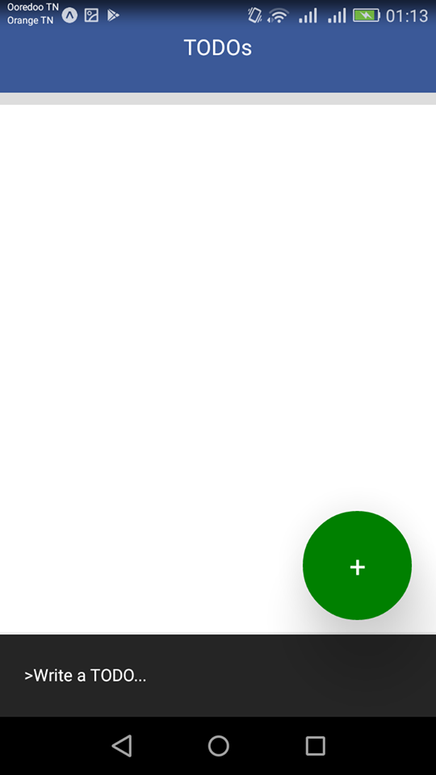

This project was bootstrapped with [Create React Native App](https://github.com/react-community/create-react-native-app).

# A Simple TODO App that illustrates basics of React Native (JSX, components, props, state..)
## 0. Overview

  
  
  

## 1. Clone this repo

`git clone https://github.com/Bahri08/rn-simple-todo-app.git` 

## 2. Install dependencies

`yarn ` 
If you don't have yarn installed, please install it with `npm install` 

## 3. Install Expo in your mobile device
[App Store](https://itunes.apple.com/us/app/expo-client/id982107779?mt=8)
[Play Store](https://play.google.com/store/apps/details?id=host.exp.exponent&hl=fr)

## 4. Serve the app and scan the QR Code
`yarn start`

